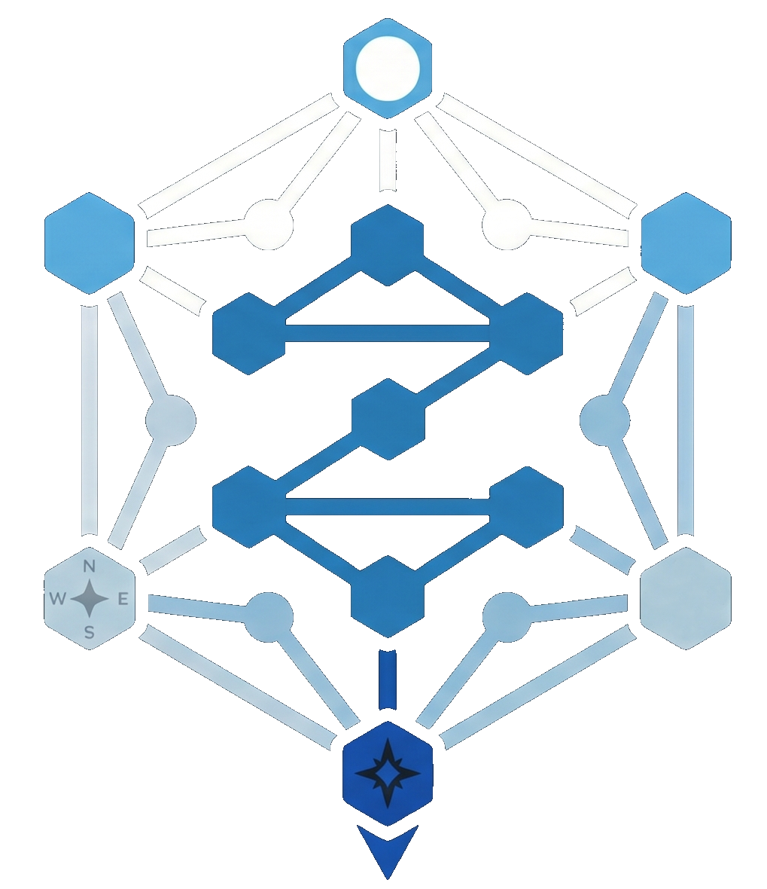
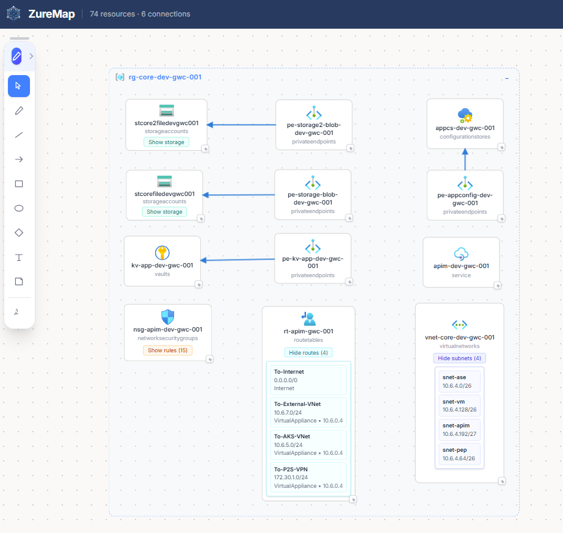
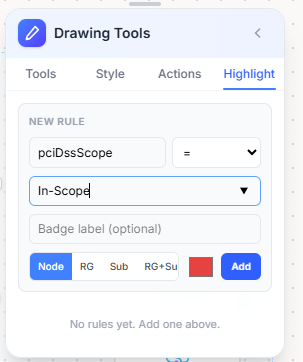
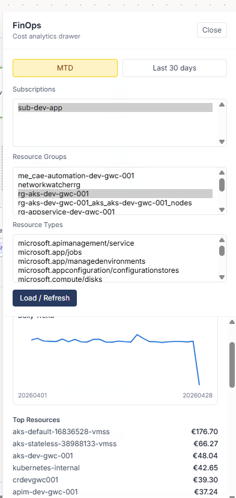
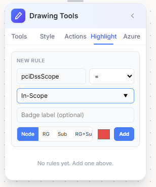
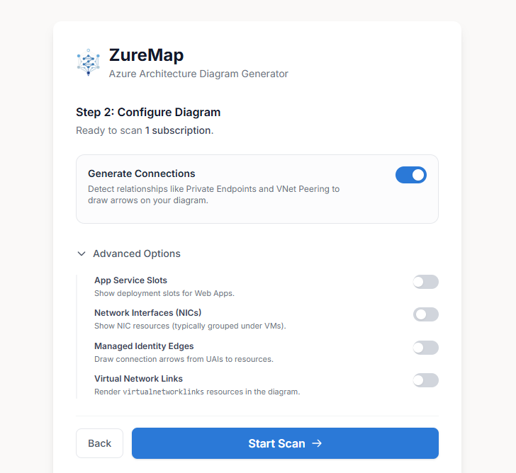
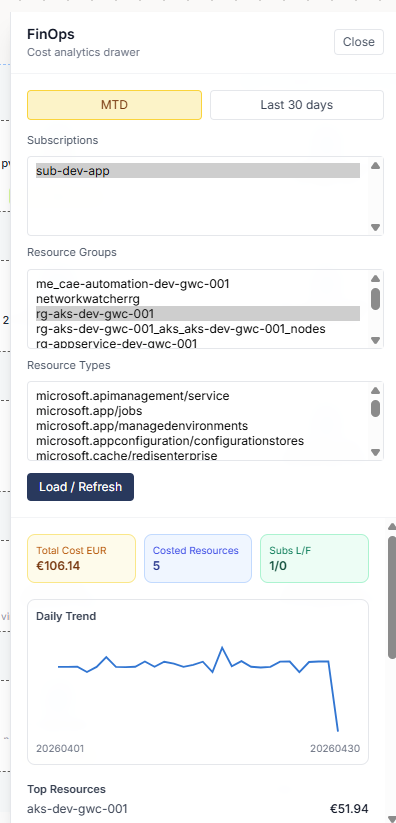

# ZureMap

<p align="center">
  
</p>

ZureMap is an intelligent Azure Architecture Diagram Generator built with Angular. It automatically scans your Azure subscriptions, discovers resources, and generates interactive architecture diagrams.

**[Try the live demo →](https://natechsa.github.io/ZureMap/#/scan)**

## Features

- **Automated Resource Discovery:** Uses Azure CLI authentication to securely scan and discover resources across one or multiple Azure subscriptions.
- **Topology & Connections:** Automatically maps virtual network topologies and resolves relationships like Private Endpoints, VNet Peering, and Managed Identity Assignments.
- **Smart Layout Engine:** Uses ELK (Eclipse Layout Kernel) to automatically compute and arrange readable architectural layouts.
- **Interactive Canvas:**
  - Grouping by Subscriptions, Resource Groups, and VNets.
  - Expandable/collapsible resource panels (e.g., Route Tables, NSGs, VM details).
  - Drag-and-drop reordering, panning, and zooming.
- **Custom Annotations:** Rich drawing tools including shapes (rectangles, diamonds, ellipses), arrows, lines, freehand drawing, and sticky notes.
- **Official Azure Icons:** Uses normalized Microsoft Azure Architecture Icons to accurately represent your cloud infrastructure.
- **FinOps & Cost Insights:** Cost visualization per resource and top cost insights directly on the diagram.
- **Export Options:** Export diagrams to images (with customizable backgrounds) or save/load JSON configurations.
- **DNS Zone Management:** View and manage DNS zones and their records within your subscription.

## Screenshots

<table>
  <tr>
    <td align="center" width="50%">
      <br/>
      <sub>Landing page</sub>
    </td>
    <td align="center" width="50%">
      <br/>
      <sub>Subscription selection</sub>
    </td>
  </tr>
  <tr>
    <td align="center" width="50%">
      <br/>
      <sub>Auto-generated architecture diagram</sub>
    </td>
    <td align="center" width="50%">
      <br/>
      <sub>Highlight resources by tag</sub>
    </td>
  </tr>
  <tr>
    <td align="center" width="50%">
      <br/>
      <sub>Add Azure resources via drawing tools</sub>
    </td>
    <td align="center" width="50%">
      <br/>
      <sub>FinOps &amp; cost insights</sub>
    </td>
  </tr>
</table>

## Prerequisites

- [Node.js](https://nodejs.org/) (v18 or higher)
- [Azure CLI](https://learn.microsoft.com/en-us/cli/azure/install-azure-cli) — required for authentication (`az login`)
- [Angular CLI](https://github.com/angular/angular-cli) v19.2+
- [Docker](https://www.docker.com/) _(required for the pre-built image path; optional for local dev)_

## Getting Started

### Local Development

1. **Install dependencies:**
   ```bash
   npm install
   # or
   make install
   ```

2. **Authenticate with Azure:**
   ```bash
   az login
   ```

3. **Start the development server:**
   ```bash
   npm run dev
   # or
   make dev
   ```
   Open `http://localhost:4200/`. The app hot-reloads on file changes.

### Docker (pre-built image)

The easiest way to run ZureMap is to pull the published image from the GitHub Container Registry — no build step required.

```bash
docker pull ghcr.io/natechsa/zuremap:latest
```

ZureMap talks to Azure through its local proxy server, which calls the Azure CLI inside the container. You need to pass your Azure credentials in at start-up. The recommended approach is to mount your local `~/.azure` directory (populated by `az login` on your host):

```bash
docker run -d \
  --name zuremap \
  -p 3001:3001 \
  -v "$HOME/.azure:/home/zuremap/.azure" \
  ghcr.io/natechsa/zuremap:latest
```

Then open [http://localhost:3001](http://localhost:3001) in your browser.

> **First time?** Run `az login` on your host machine first so the credentials directory exists before mounting it.

#### Pin to a specific version

```bash
docker pull ghcr.io/natechsa/zuremap:0.1.0
```

Available tags: `latest` (current `main`), semver releases (e.g. `0.1.0`), and per-commit `sha-<short>` tags for exact reproducibility. See all tags at [ghcr.io/natechsa/zuremap](https://github.com/natechsa/zuremap/pkgs/container/zuremap).

#### Using Docker Compose

```yaml
services:
  zuremap:
    image: ghcr.io/natechsa/zuremap:latest
    ports:
      - "3001:3001"
    volumes:
      - $HOME/.azure:/home/zuremap/.azure
    restart: unless-stopped
```

```bash
docker compose up -d
```

### Docker (build locally)

Run ZureMap in a container built from source (the image includes Azure CLI):

```bash
# Build and start
make docker-up

# Stop and remove
make docker-down

# Tail logs
make docker-logs
```

The container serves the app on port `3001`.

## Available Commands

| Command | Description |
|---|---|
| `make dev` | Start proxy + Angular dev server |
| `make build` | Production build |
| `make test` | Run unit tests (single run) |
| `make test-watch` | Run unit tests in watch mode |
| `make lint` | Lint the project |
| `make clean` | Remove build artifacts and caches |
| `make map-icons` | Regenerate Azure icon mappings |
| `make docker-build` | Build the Docker image |
| `make docker-up` | Build and start the container |
| `make docker-down` | Stop and remove the container |
| `make docker-logs` | Tail container logs |

Run `make help` to see all available targets.

## Project Structure

```
src/
  app/
    features/
      scan/     # Subscription selection, scanning options, resource graph discovery
      canvas/   # Interactive diagramming surface (elkjs, drawing/layout services)
    core/
      services/ # Azure auth, resource mapping, connection resolving
scripts/
  map-icons.js  # Normalizes raw Azure Architecture SVGs for use in ZureMap
proxy/
  server.js     # Local proxy server for Azure CLI API calls
```

## Updating Icons

To update the official Azure icons, download the latest SVG pack and run:

```bash
npm run map-icons -- --source /path/to/downloaded-icons
# or
make map-icons
```

This normalizes filenames, copies them to `assets/azure-icons/`, and regenerates `icon-manifest.json`.

## Testing

```bash
make test        # single run
make test-watch  # watch mode
```

## License

ZureMap is source-available under the [Elastic License 2.0 (ELv2)](./LICENSE.md).

**You are free to:** use, modify, and distribute ZureMap for personal or internal business purposes.

**You may not:**
- Provide ZureMap (or a derivative) to third parties as a hosted or managed service.
- Re-sell, sublicense, or commercially distribute ZureMap as a standalone product or embedded service.
- Remove or obscure licensing, copyright, or other notices.

See [LICENSE.md](./LICENSE.md) for the full terms.
